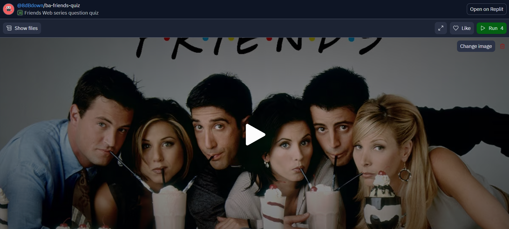
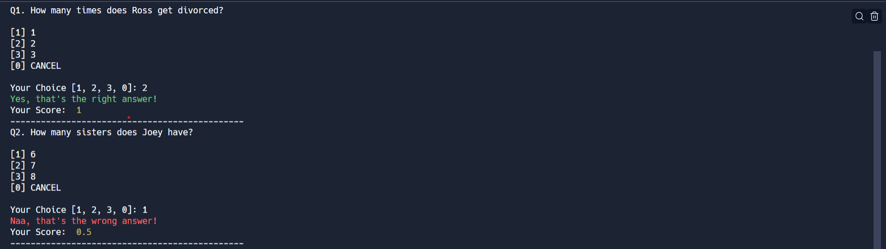
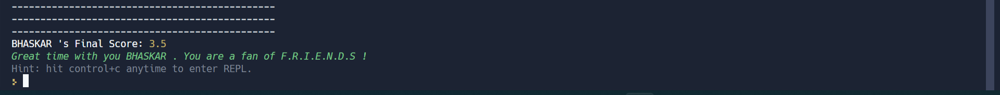
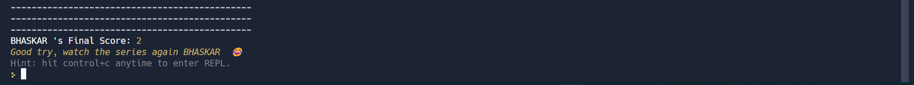
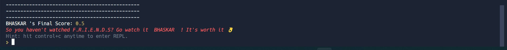

# FRIENDS Web series quiz using CLI
A simple choice type quiz game to test your memory and knowledge on the web series called FRIENDS.

Here are a few project-related insight pictures:

1. Landing Page 

2. Conditional result based on right/wrong choices selected

3. If you answered almost all questions correctly you receive appreciation

4. If you answered some questions incorrectly, following is the result you get

5. If you answered almost all incorrectly, it says to watch the web series

> Technologies/Libraries used :-
* Vanilla Javascript
* Chalk (for CSS)
* readline-sync

> Platform userd to develop project :-
* [Replit](https://replit.com/)

